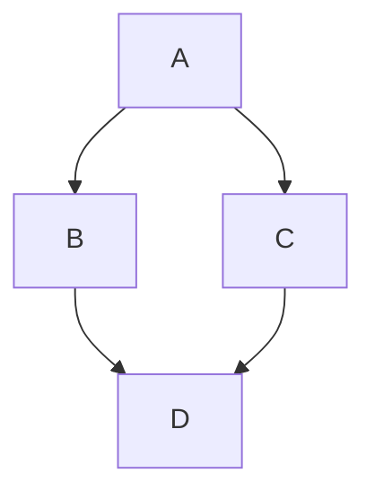

# 🌐 pankajkumar.xyz

[](https://www.getzola.org/)
[](https://pages.cloudflare.com/)
[](https://pankajkumar.xyz)

The source code for my personal website and blog, available at [pankajkumar.xyz](https://pankajkumar.xyz).

---

## 🛠️ Tech Stack & Theme

- **Framework:** [Zola](https://www.getzola.org/) (A fast static site generator in Rust)
- **Deployment:** Cloudflare Pages
- **Theme:** Inspired by [mr-karan.dev](https://mrkaran.dev), which was originally adapted from [zola-bearblog](https://codeberg.org/alanpearce/zola-bearblog).

### ✨ Enhancements & Features

I have heavily customized the base theme to meet my personal requirements and improve the overall UX:

- 🔍 **Global Search:** Interactive modal for full-text site search.
- 🏷️ **Topics Taxonomy:** A unified page to browse global tags across posts and notes.
- 📱 **Responsive Design:** Fully fluid and responsive layout, including a dynamic sticky Table of Contents that perfectly adapts across mobile, tablet, and desktop views.
- 📄 **AJAX Pagination:** Seamless, JavaScript-powered pagination without page reloads.
- ⬆️ **Back to Top:** Convenient floating button for long articles.
- 🖼️ **Dynamic OG Images:** Automated Open Graph image generation for rich social sharing.
- 🔗 **Share & Navigate:** Built-in social sharing buttons ("Share via") and intuitive Next/Previous post navigation for better content discovery.
- 🎨 **UI Polish:** Various typography, spacing, component-centering, and styling improvements for a highly polished reading experience.

---

## 🚀 Local Development

### Prerequisites
- [Zola](https://www.getzola.org/documentation/getting-started/installation/) (for serving the site)
- [uv](https://github.com/astral-sh/uv) (for running python scripts)
- `make`

### Serving the Site
To spin up a local development server (drafts included):

```bash
zola serve --drafts
# or
make preview
```

### Generating Open Graph (OG) Images

The site uses a Python script to automatically generate preview images for social media sharing. While Cloudflare Pages handles this automatically during deployment, you can run it locally to preview changes:

```bash
uv run scripts/generate_og_images.py
# or
make og-images
```

---

## 📝 Content Creation

You can quickly scaffold new articles using the provided `make` commands. These commands automatically generate properly formatted Markdown files in the correct directories (`content/posts`, `content/travel`, or `content/rtd`) and pre-populate the TOML frontmatter (including correctly formatted `slug`, `date`, `title`, and `description`).

### Syntax
```bash
make <type> <Title>[, <Description>]
```
- `<Title>` is **required**.
- `<Description>` is **optional** (separated from the title by a comma).
- *Note: You do not need to wrap the arguments in quotes.*

### Examples

```bash
# Create a new Post with a description
make post Setting Up Pi-hole, A guide to setting up a highly available pi-hole cluster

# Create a new Travel log (no description)
make travel My Trip to Tokyo

# Create a new RTD (Read The Docs) entry
make rtd How to configure Nginx, A quick reference for Nginx routing
```

### 🧑‍💻 Code Block Diffs

You can highlight line additions and deletions in your Markdown code blocks (similar to Shiki) while maintaining Zola's native syntax highlighting. This works universally across different programming languages by using their native comment syntax.

Just append `[!code ++]` or `[!code --]` inside a comment at the end of a line in your code block:

````markdown
```kotlin
fun main() {
    println("Hello Old World") // [!code --]
    println("Hello New World") // [!code ++]
}
```
````

The site's JavaScript automatically detects and strips the comment marker, colors the line background green or red, and adds a `+` or `-` indicator at the far left edge. The marker is also safely excluded when users copy the code.

It natively supports the following comment styles across any language:
- `// [!code ++]` (Kotlin, Java, C++, JS, Go, Rust)
- `# [!code ++]` (Python, Ruby, Bash, YAML)
- `-- [!code ++]` (SQL, Lua, Haskell)
- `/* [!code ++] */` (CSS, C)
- `<!-- [!code ++] -->` (HTML, XML)

### 🧜‍♀️ Mermaid Diagrams

You can easily embed rich diagrams and flowcharts directly into your articles using Mermaid syntax.

Simply create a code block with `mermaid` as the language:

````markdown

````

The site will automatically detect these blocks, load the necessary local scripts, and render them as interactive vector graphics on the page.

---

## 📄 Licenses

This repository contains two primary licenses:

- **Source Code**: All source code, templates, and scripts in this repository are licensed under the [GNU General Public License v3.0 (GPLv3)](LICENSE).
- **Content**: All original content, articles, images, and text are licensed under the [Creative Commons Attribution-ShareAlike 4.0 International (CC BY-SA 4.0)](LICENSE-CONTENT).

Additionally, this project builds upon open-source software and themes. Please see [THIRD-PARTY-LICENSES.md](THIRD-PARTY-LICENSES.md) for licensing information regarding Zola, Bearblog, and other third-party components.