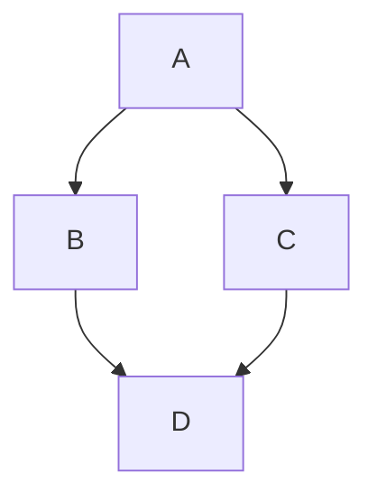

<div align="center">

# pankajkumar.xyz

My personal website, blog, and digital home on the internet.

<p align="center">
  <a href="https://pankajkumar.xyz"></a>
  <a href="https://github.com/ipankajkumar93"></a>
</p>

<p align="center">
  <a href="https://www.getzola.org/"></a>
  <a href="https://pages.cloudflare.com/"></a>
  <a href="https://pankajkumar.xyz"></a>
  <a href="LICENSE"></a>
  <a href="LICENSE-CONTENT"></a>
  <a href="THIRD-PARTY-LICENSES.md"></a>
</p>

</div>

---

## 🌐 Overview

This repository contains the complete source for my personal site — a fast, minimal static site built with [Zola](https://www.getzola.org/) and served via Cloudflare Pages. The theme is heavily customized from its [bearblog](https://codeberg.org/alanpearce/zola-bearblog) roots, with significant UX improvements, a Geist + Instrument Serif + JetBrains Mono font stack, a stone-palette WCAG-compliant color system, and a range of interactive features built in vanilla JavaScript.

The site covers writing, homelab notes, read-the-docs references, project logs, and travel — all accessible under a unified search and tag taxonomy.

---

## 🛠️ Tech Stack

| Layer | Technology |
|---|---|
| Static Site Generator | [Zola](https://www.getzola.org/) (Rust) |
| Hosting & CDN | [Cloudflare Pages](https://pages.cloudflare.com/) |
| Search | [elasticlunr.js](http://elasticlunr.com/) |
| Syntax Highlighting | Zola native (built-in) |
| Diagrams | [Mermaid.js](https://mermaid.js.org/) |
| OG Image Generation | Python + [Pillow](https://pillow.readthedocs.io/) via `uv` |
| Analytics | [Umami](https://umami.is/) (self-hosted, privacy-first) |
| Theme Lineage | [mr-karan.dev](https://mrkaran.dev) → [zola-bearblog](https://codeberg.org/alanpearce/zola-bearblog) |

---

## ✨ Features

**🧭 Navigation & UX**
- Shell-language nav prefixes (`>`, `./`) matching the site's terminal aesthetic
- Native browser navigation (no SPA routing)
- Smooth `@view-transition` page transitions with clip-path reveal for theme toggling
- Responsive sticky Table of Contents (mobile, tablet, desktop)
- Floating back-to-top button for long reads

**🔍 Content & Discovery**
- Full-text site search via elasticlunr modal
- Topics taxonomy — unified tag browsing across posts and notes
- AJAX pagination — seamless page turns without full reloads
- Next / Previous post navigation
- Social sharing buttons ("Share via")

**💻 Code & Writing**
- Inline diff highlighting (`[!code ++]` / `[!code --]`) across all major comment styles
- Mermaid diagram rendering (auto-detected fenced code blocks)
- Code copy button with correct handling of soft-wrapped lines
- JetBrains Mono monospace stack for all code surfaces

**🎨 Design & Theming**
- Stone-palette dark/light color system with WCAG-compliant three-tier text hierarchy
- Light/dark theme toggle with View Transitions API clip-path reveal
- Dynamic Open Graph image generation for social sharing
- PWA manifest
- Custom inline SVG icon system using macro

**☁️ Deployment**
- Cloudflare Pages with custom `_headers` for correct CSP and MIME types
- Automated OG image generation in the Pages build pipeline

---

## 💻 Local Development

### 📦 Prerequisites

- [Zola](https://www.getzola.org/documentation/getting-started/installation/)
- [uv](https://github.com/astral-sh/uv) (for OG image generation)
- `make`

### ⚡ Quick Start

```bash
# Clone the repo
git clone https://github.com/ipankajkumar93/pankajkumar.xyz.git
cd pankajkumar.xyz

# Serve locally with drafts enabled
zola serve --drafts

# or via make
make preview
```

The site will be available at `http://127.0.0.1:1111`.

### 🖼️ Generating OG Images

OG images are generated automatically during Cloudflare Pages builds. To preview them locally:

```bash
uv run scripts/generate_og_images.py

# or via make
make og-images
```

---

## 📝 Content Authoring

New content is scaffolded via `make` commands that generate Markdown files with pre-populated TOML frontmatter (slug, date, title, description) in the correct directory.

### 🔤 Syntax

```bash
make <type> <Title>[, <Description>]
```

`<Title>` is required. `<Description>` is optional, separated by a comma. No quotes needed.

### 🧾 Commands

| Type | Directory | Command Example |
|---|---|---|
| `post` | `content/posts/` | `make post Setting Up Pi-hole, A guide to a HA Pi-hole cluster` |
| `travel` | `content/travel/` | `make travel My Trip to Tokyo` |
| `rtd` | `content/rtd/` | `make rtd How to configure Nginx, A quick Nginx reference` |

---

## ✍️ Writing Conventions

These are intentional style choices baked into the site's voice:

- **Article signatures:** `Flush!`
- **Footer:** _Crafted with ❤️ by Pankaj Kumar_
- **Nav prefixes:** `>` and `./` (shell-language aesthetic)

> 📖 For a full reference of supported Markdown syntax, formatting elements, and content patterns used across the site, see the **[Post Syntax Guide](https://www.pankajkumar.xyz/posts/post-syntax-guide/)**.

---

## 🧑‍💻 Code Block Features

### ➕ Diff Highlighting

Highlight additions and deletions in any language using its native comment syntax:

````markdown
```kotlin
fun main() {
    println("Hello Old World") // [!code --]
    println("Hello New World") // [!code ++]
}
```
````

Supported comment styles:

| Style | Languages |
|---|---|
| `// [!code ++]` | Kotlin, Java, JavaScript, Go, Rust, C++ |
| `# [!code ++]` | Python, Ruby, Bash, YAML |
| `-- [!code ++]` | SQL, Lua, Haskell |
| `/* [!code ++] */` | CSS, C |
| `<!-- [!code ++] -->` | HTML, XML |

The marker is stripped from the rendered output and excluded when copying.

### 🧜‍♀️ Mermaid Diagrams

Embed diagrams using a standard fenced code block with `mermaid` as the language identifier. The site auto-detects these, loads the renderer, and outputs interactive SVGs.

````markdown

````

---

## 🗂️ Site Sections

| Section | Path | Description |
|---|---|---|
| Posts | `/posts/` | Long-form articles and technical write-ups |
| Topics | `/topics/` | Global tag taxonomy across all content |
| RTD | `/rtd/` | Read the Docs — quick-reference notes |
| Projects | `/projects/` | Side projects and builds |
| Services | `/services/` | Tools and services I run |
| Travel | `/travel/` | Travel logs |
| Contact | `/contact/` | Get in touch |

---

## 📄 Licenses

This project uses separate licenses for code and content.

| Component | License |
|---|---|
| Source code, templates, scripts | [GNU General Public License v3.0 (GPLv3)](LICENSE) |
| Articles, writing, images | [Creative Commons BY-SA 4.0](LICENSE-CONTENT) |
| Third-party components | [THIRD-PARTY-LICENSES](THIRD-PARTY-LICENSES.md) |

Third-party components and their licenses are fully documented in [`THIRD-PARTY-LICENSES.md`](THIRD-PARTY-LICENSES.md). They include:

| Component | Purpose | License |
|---|---|---|
| [Zola](https://www.getzola.org/) | Static site generator | MIT |
| [zola-bearblog](https://codeberg.org/alanpearce/zola-bearblog) | Base theme (via mr-karan.dev) | MIT |
| [Mermaid.js](https://mermaid.js.org/) | Diagram rendering | MIT |
| [Geist](https://vercel.com/font) | Primary sans-serif font | OFL 1.1 |
| [Instrument Serif](https://github.com/Instrument/instrument-sans) | Typography accent font | OFL 1.1 |
| [JetBrains Mono](https://www.jetbrains.com/lp/mono/) | Monospace / code font | OFL 1.1 |
| [Pillow](https://python-pillow.org/) | OG image generation | HPND |
| [Requests](https://requests.readthedocs.io/) | GitHub API data fetching | Apache 2.0 |

---

<div align="center">

Crafted with ❤️ by [Pankaj Kumar](https://pankajkumar.xyz)

</div>