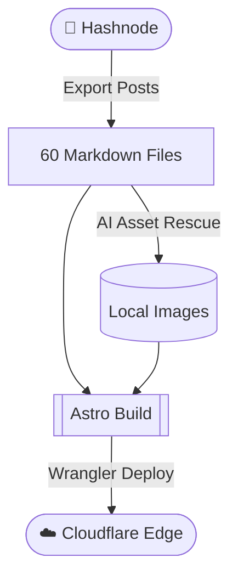

+++
draft = true # Set this to false when you're ready to publish the article to production
slug = "51-my-developer-blogging-journey-so-far"
type = "post"
in_search_index = true
title = "51-my-developer-blogging-journey-so-far"
description = ""
date = 2026-07-12
# updated = 2026-07-12

[extra]
toc = true
featured = false
# og_preview_img = "/images/sample-image.jpeg" # Uncomment to specify a custom OG preview image, otherwise the build script will auto-generate one.

[taxonomies]
post_tags = ["post"]
+++


Hey everyone 👋🏻, welcome back! Today I want to talk about something slightly different from my usual Android engineering posts. I want to talk about the platform you are reading this on right now.

Since 2019, I have published over 60 technical blogs. My journey started on **Medium**, which gave me a wonderful home to start writing and a huge built-in audience to learn from. Then I moved to **Hashnode** for its custom domain support and developer focused experience, and it helped me grow my own voice over the years. Both platforms served me really well. But recently, my own workflow started drifting in a direction that was easier to support on infrastructure I owned myself.

Today, I am thrilled to announce that my blog has a new, permanent home. It is custom built from the ground up using **Astro**, hosted on **Cloudflare Pages**, and heavily pair programmed with Google's **Antigravity AI agent**.

Let us dive into the high level blueprint of how I pulled it off! 🚀

---

## 🪄 It Started With a Question

To be honest, I wasn't even planning to move off Hashnode that weekend. I was just curious. I opened Google Antigravity and typed out what had been on my mind:

<div class="post-callout">
  <div class="emoji">💬</div>
  <div class="content">
    <strong>My prompt to Antigravity:</strong><br>
    "I have a technical blog on Hashnode with 60+ posts. I'd like to have more control over the layout, improve performance, and move to a git based workflow. What are my options if I want to own every part of my setup from content to deploy?"
  </div>
</div>

I expected a list of "top 10 blogging platforms." What I got back was a confident recommendation for **Astro + Cloudflare Pages**, with reasons I hadn't considered. Zero JavaScript shipped by default. Islands architecture for when I do need it. A free Cloudflare edge network. Pure markdown files sitting in git.

Here's the funny part. I had never even heard of Astro before that moment. 🌱

---

## 🛤️ What I Wanted Next

Hashnode is a fantastic platform and it has genuinely served me really well for years. Over time though, a few things in my own workflow started pointing me toward owning the stack myself:

1. **More Layout Control**: As the platform evolved, some design directions didn't quite fit the look I wanted for my posts. That is a totally fair product choice on their end. I just felt ready to shape every pixel myself.
2. **A Reader Verification Issue**: A small set of readers were occasionally hitting a browser verification screen before they could view my posts. I reached out for help but wasn't able to get to the root cause, and I felt bad for readers who bounced off that friction.
3. **OG Preview Consistency**: I noticed some of my posts showing up on Slack and social without their Open Graph previews. For a blog where I share a lot of posts with teams, those preview cards matter a lot to me.
4. **Performance I Could Tune Myself**: Any managed platform naturally includes things I don't always use. Owning the full stack meant I could aggressively tune Lighthouse scores for my specific content.
5. **Native Video Support**: Hashnode is built around still images, so every demo I've ever published was a GIF I had to record, convert, and manually upload. A single four second animation would often end up as a multi megabyte file. The pain here is really about the GIF format itself, but the workflow had been grinding on me for a while. 😅
6. **A Git Native Writing Workflow**: I had gradually shifted to drafting posts locally with AI assistants, and I wanted my posts to just live in a Git repo. That is more about how I write today than anything to do with Hashnode specifically.

It felt like the right moment to try running my own setup, where I controlled every pixel, every byte, and every deployment.

---

## 🛠️ The Stack I Landed On

After that initial conversation with Antigravity, the stack kind of picked itself.

**Astro** is practically designed for content rich websites. It ships zero JavaScript by default, making it blazingly fast. When I do need interactivity (like the pinch to zoom lightbox you can try on any image in this post), Astro lets me ship client side JS only where it's needed through its Islands architecture. Markdown and MDX are first class citizens. My Git repository is now my database.

For hosting, I went with **Cloudflare Pages**. Their global Edge network is incredibly fast, and their worker integrations mean I can handle dynamic routing without breaking a sweat. Did I mention it's free on the starter tier? 😄

---

## 🤖 Pair Programming Through a Weekend

Instead of doing everything manually, Antigravity and I pair programmed the entire migration in a single weekend. Two days, start to finish. ☀️🌙

The AI went through all 60 of my Markdown files and normalized Hashnode's specific Markdown flavor into plain, standard Markdown. This alone saved me weeks of manual editing.

<div class="post-callout">
  <div class="emoji">🧠</div>
  <div class="content">
    <strong>The "asset rescue" prompt:</strong><br>
    "Iterate through all .md files in the blog directory. Find any image URLs hosted on cdn.hashnode.com. Download those images to src/assets/images/, giving them a slugified filename based on the post title. Finally, update the Markdown files to use the new local relative paths."
  </div>
</div>

Using this prompt, Antigravity generated a temporary Node.js script. I saved it as `rescue-assets.js` in my root folder and ran `node rescue-assets.js`. It chewed through all 60 files while I watched the terminal. It was a true pair programming experience.

_(Fun fact: Antigravity even generated the dynamic OG images for the blog site using the Gemini Nano model behind the scenes. I also had it design the cover image for this very post.)_

---

## 🗺️ The Migration Journey

### Phase 1: The Blueprint and Backup

We started with a clean Astro template. I downloaded my entire blog backup from Hashnode, which gave me raw Markdown files. We imported these directly into Astro's `src/content/blog` directory.

### Phase 2: AI Assisted Asset Rescue

Hashnode hosted all my images on their own CDN. If I closed my account, those images would break. Our markdown files were filled with URLs looking like this: `https://cdn.hashnode.com/res/hashnode/image/upload/...`. What we wanted was clean, local paths like `../../assets/images/...`.

We wrote a quick Node.js script using the `fs` and `path` modules combined with Regular Expressions to find, download, and replace these links. The logic looked something like this:

```javascript
// A simplified look at the rescue logic
const content = fs.readFileSync(file, "utf8");
// Finds the hashnode URL and stops capturing when it hits a closing parenthesis
const matches = content.match(/https:\/\/cdn\.hashnode\.com\/[^\)]+/g);

for (const url of matches) {
  const localPath = await downloadImage(url, targetDir);
  newContent = newContent.replace(url, localPath);
}
```

For heavy GIF and video assets that exceeded Cloudflare's 25 MiB size limit, we smartly offloaded them to GitHub Raw URLs.

### Phase 3: Total Backward Compatibility

One of my biggest requirements was not breaking existing links. Many of my blogs have thousands of views and are linked across Reddit, Twitter, and StackOverflow. We ensured that the URL structure from `blog.shreyaspatil.dev` remained completely identical in the new Astro setup.

### Phase 4: Redesign, Theming & Porting the Best Features

I wanted to combine the best parts of Medium and Hashnode while giving it my own distinct flavor:

- **Homepage Redesign & Pagination**: We rebuilt the homepage to elegantly showcase featured posts and cleanly paginate through my back catalog, ensuring readers can easily find older content without endless scrolling.
- **Flawless Light & Dark Modes**: No more jarring flashes! We fine tuned a beautiful, system aware light and dark theme that feels native and easy on the eyes.
- **Premium Code Snippets**: As an Android engineer, code blocks are the heart of my blog. We implemented high contrast [Shiki](https://shiki.style) syntax highlighting, complete with line diffs and a one click copy button.

```kotlin
// Example of the new Shiki highlighting + diffs
fun main() {
    println("Hello Old World") // [!code --]
    println("Hello New Astro World! 👋") // [!code ++]
}
```

- **Medium Style Lightbox**: We built a custom, vanilla JavaScript pinch to zoom lightbox.
- **Native Callouts**: We built native Markdown highlight components using clean CSS, replacing the inline HTML callout pattern I used to write by hand.
- **Mermaid Diagrams**: We now have native support for [Mermaid.js](https://mermaid.js.org/). This means I can write technical flowcharts directly in Markdown without ever having to export an image again!



- **Beautiful Typography**: I brought over my favorite font combination: **Merriweather** for the reading body and **Inter** for crisp headings.

### Phase 5: SEO and Deployment Magic

We used the AI agent to read through any blogs missing meta descriptions and safely generate SEO friendly summaries. We also set up aggressive link prefetching, so now when you hover over a blog card, it loads in the background.

Finally, for deployment, we shifted to a purely static **assets only** deployment strategy. Instead of running heavy [SSR (Server Side Rendering)](https://astro.build/blog/ssr-release/), we simply use the [Wrangler CLI](https://developers.cloudflare.com/workers/wrangler/) to push our compiled folder directly to Cloudflare's Edge network:

```bash
# The magic command
npm run build && npx wrangler pages deploy dist
```

The result is instantaneous, globally distributed page loads that feel incredibly snappy across both desktop and mobile.

---

## 🎥 Videos That Actually Work

Remember the GIF workflow I mentioned earlier? On this new setup, any `.gif` I drop into a markdown file gets automatically converted into a proper WebM video at build time.

Here's a demo pulled straight from one of my older posts on [scheduling FCM push notifications](/scheduling-fcm-push-notifications-on-device-android-2d3bb9653b4d). It used to live on that post as a chunky GIF. On this new setup, the exact same clip now plays back as a tiny WebM with real play controls:

<video autoplay loop muted playsinline controls preload="metadata" class="gif-video" src="/videos/content/scheduling-fcm-push-notifications-on-device-android-2d3bb9653b4d/img-5c2e816a.webm" aria-label="FCM push notification scheduling demo"></video>

Same visual, much lighter on bandwidth, and you can actually pause and replay it now (which is something a GIF physically cannot do). 🎬

Going forward, I'm cutting GIFs out of my workflow entirely. Every new demo I record will be saved straight to WebM or MP4 and embedded just like the one you see above. No more screen recorder to GIF conversion dance. No more uploading a multi megabyte animation for a four second clip. From now on, this blog speaks video natively. ✂️

For the old posts, the best part is that I didn't have to touch a single line of their markdown to bring them along. More on that in a second. 👇

---

## ⚡ Making Every Byte Count

Once the content was migrated, I turned to performance. Hashnode used to handle this invisibly through their CDN, but now I owned the whole pipeline. Equal parts exciting and terrifying. 😅

I opened my `src/assets/images` folder and my jaw dropped. The cover images alone stretched well over 5 MB each. Screenshots sat at 8K resolution for no reason. Six years of "just upload whatever Figma spit out" had quietly piled up.

So I asked Antigravity to write a small compression script using Sharp, which Astro already ships with. The rules were simple:

- Cap image width at 2400 px, which is 2x the display size so retina screens stay crisp 🔍
- Keep PNGs fully lossless, just crank up the zlib compression level
- Run JPEGs through mozjpeg at quality 86, which is visually indistinguishable from the original
- Skip any file where savings would be trivial, so a single run doesn't dirty a hundred files in git for byte level gains

One script run later, the repo was roughly half its original size, with zero visible quality loss. 🎯

That's just the input. Astro's `<Image>` component does a second pass at build time, turning every PNG into responsive WebP variants sized exactly for the reader's device. So on a phone you often download a tiny WebP, not the original source PNG.

### The plugin that kept my markdown clean

For the GIF to video conversion I mentioned earlier, the tempting path would have been to go through every old post and manually rewrite the image syntax. Sixty posts, hundreds of references, endless room to break something.

I went the other way. I wrote a tiny remark plugin that runs at build time. It walks the markdown AST, finds any image pointing to a `.gif`, checks if a matching WebM exists on disk, and if so rewrites that node to a proper `<video>` tag. My markdown source files stay 100% untouched. Readers get the optimized video. ✨

If the WebM isn't there for some reason, the plugin quietly does nothing and the GIF still renders normally. No breakage, no manual migration, no rewriting thousands of lines of old posts.

A few more small perf touches that compound together:

- `font-display: swap` so body text shows up immediately in a fallback font instead of staying invisible while Inter and Merriweather load
- `fetchpriority="high"` on each post's cover image so the browser pulls it first
- View Transitions for smooth page to page navigation
- `prefers-reduced-motion` support, so if your OS is set to limit animations, this blog listens 🫶

---

## 🏁 Conclusion

Of course, no migration is perfect. There are a few small things I'll be missing from this new setup:

1. **Comments and Discussions**: I haven't implemented a native commenting system yet.
2. **Lifetime Reads and Views**: We integrated Google Analytics for future tracking, but it will not carry over the historical lifetime views from Hashnode.
3. **A Built-in Mailing List**: Both Medium and Hashnode gave me a lovely subscriber newsletter out of the box. I don't have that on my own stack yet, and I'll definitely be missing it. 📬

That last one has a nice workaround though. I'm planning to keep cross posting every new article on **Medium** so readers who discover me there can still subscribe and follow along in the way they're used to. On the **Hashnode** side, I'll be gracefully retiring my blog there and pointing everyone to this new home, so there's a single place to find me going forward.

These feel like completely acceptable trade offs for the speed, control, and developer experience I now have. Medium and Hashnode both played a huge role in getting me here, and I'll always be grateful for the years I spent on both. This chapter just feels like the next natural step for where my writing is headed.

The best part? You can see exactly how it is built. **The entire repository is open source!** Feel free to check out the code, steal the lightbox feature, or fork it to build your own dream blog.

Check out the source code here: [patilshreyas/blog.shreyaspatil.dev](https://github.com/patilshreyas/blog.shreyaspatil.dev)

And if you are reading this right now, congratulations! You are experiencing the final result of this journey on our brand new platform. Welcome to the new era of the blog! 🎉

### References

- [Astro Documentation](https://docs.astro.build/)
- [Cloudflare Workers](https://workers.cloudflare.com/)
- [Deploying Astro to Cloudflare Pages](https://docs.astro.build/en/guides/deploy/cloudflare/)

Thanks for reading, and happy coding! 💻✨