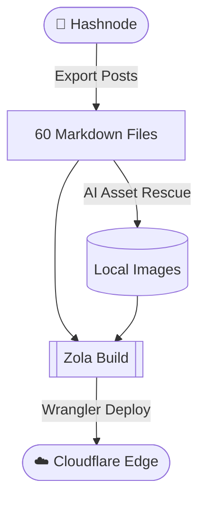

+++
draft = false
slug = "post-syntax-guide" # Overrides the URL path for this page (e.g. /posts/syntax-guide/)
type = "post" # Other types are also possible like "rtd", "travel", etc.
in_search_index = true
title = "Markdown Syntax & Shortcodes Guide"
description = "A comprehensive sample post demonstrating every unique type of markdown syntax, HTML element, and Zola shortcode supported on this website."
date = 2026-06-23
updated = 2026-07-12

[taxonomies]
post_tags = ["post", "markdown", "syntax", "guide"]

[extra]
toc = true # Generates Table of Contents for the page if true
featured = false
license = "CC-BY-SA-4.0"
# og_preview_img = "/images/sample-image.jpeg"    #Uncomment this to add your own OG preview image or let the python script generate one for you for OG images.
+++

This post serves as a reference guide to showcase all the various syntax and formatting options available when writing content for this blog.

## 1. Headings

Headings are created using the `#` symbol. The `h1` is automatically populated from the title frontmatter, so you should start with `h2` (`##`) for major sections within your post.

### This is an h3 (Sub-heading)

Use `###` for sub-sections.

#### This is an h4

And `####` for even deeper nesting if absolutely necessary.

---

## 2. Text Formatting

You can format your text in a variety of ways to emphasize certain points:
- Use **double asterisks** for **bold text**.
- Use *single asterisks* or _underscores_ for *italic text*.
- You can even combine them for ***bold italics***.
- Strikethrough is done using double tildes: ~~this text is crossed out~~.

## 3. Inline Code and Code Blocks

When mentioning a variable, command, or file path in the middle of a sentence, use single backticks for `inline-code`. For example: "Be sure to edit your `config.toml` file."

For larger snippets, use fenced code blocks. Specify the language for proper syntax highlighting:

### Bash Example
```bash
#!/bin/bash
echo "Hello, world!"
BACKUP_PATHS=("/mnt/storage" "/home/pankaj/stacks")
for path in "${BACKUP_PATHS[@]}"; do
    echo "Backing up $path..."
done
```

### Python Example
```python
def fetch_data(url):
    """Fetches data from the given URL."""
    response = requests.get(url)
    return response.json()
```

## 4. Links

Standard links are created using square brackets for the text and parentheses for the URL:
[Visit my GitHub profile](https://github.com/ipankajkumar93)

## 5. Lists

### Unordered Lists
You can use `-` or `*` for bulleted lists:
* First item
* Second item
  * Nested item A
  * Nested item B
* Third item

### Ordered Lists
Use numbers followed by a period:
1. First step
2. Second step
3. Final step

## 6. Blockquotes

To quote text from another source or highlight an excerpt, use the `>` symbol:

> "Simplicity is the ultimate sophistication." 
> - Leonardo da Vinci

## 7. Tables

Markdown tables are great for structured data:

| Service | Port | Description |
| :--- | :---: | ---: |
| **Gitea** | `3000` | Self-hosted Git service |
| **Pi-hole** | `53` | Network-wide ad blocking |
| **Grafana** | `3000` | Observability dashboards |

## 8. Images and GIFs

There are four main ways to add images depending on your needs.

### Method A: Standard Markdown Image
The simplest way to embed an image or a GIF:


### Method B: Image with Caption (Zola Shortcode)
Use the custom `img_caption` shortcode to beautifully display an image with a caption below it:
{{ img_caption(path="/images/sample-image.jpeg", caption="This is a profile picture with a caption.") }}

### Method C: Lightbox Image (Click to Zoom)
If you want the user to be able to click the image and view it in a full-screen overlay (lightbox), use this raw HTML snippet:

<div style="text-align: center;">
<a href="/images/sample-image.jpeg" class="lightbox-thumbnail" data-featherlight="image">
    
</a>
</div>

### Method D: Image Grid (Side-by-Side Images)
When you have multiple related images (like progress shots of a homelab build or multiple dashboard screenshots), stacking them vertically takes up too much space. The `image-grid` class creates a responsive 2-column grid that automatically handles spacing and scales down to a single column on mobile. It even gracefully centers the last image if there is an odd number of photos!

<div class="image-grid">
<a href="/images/sample-image.jpeg" class="lightbox-thumbnail"></a>
<a href="/images/sample-image.jpeg" class="lightbox-thumbnail"></a>
<a href="/images/sample-image.jpeg" class="lightbox-thumbnail"></a>
</div>

## 9. Media Embeds (Maps & YouTube)

### Maps (Google Maps / My Maps)
You can directly embed custom Google Maps or My Maps using the standard HTML iframe snippet. The site will render it inline perfectly:

<iframe src="https://www.google.com/maps/embed?pb=!1m18!1m12!1m3!1d3022.1422937950147!2d-73.98731968482413!3d40.75889497932681!2m3!1f0!2f0!3f0!3m2!1i1024!2i768!4f13.1!3m3!1m2!1s0x89c25855c6480299%3A0x55194ec5a1ae072e!2sTimes+Square!5e0!3m2!1sen!2sus!4v1560413669145!5m2!1sen!2sus" width="640" height="480"></iframe>

### YouTube Videos
There are two primary ways to embed YouTube videos that are used across the site.

#### Method A: Native Embed (Zola Shortcode)
Use the custom `youtube` shortcode to embed the full interactive iframe directly into the post:
{{ youtube(id="dQw4w9WgXcQ") }}

#### Method B: Lightweight Image Link
For better page-load performance, you can use a thumbnail image that links out to the video instead of loading an iframe:
[](https://www.youtube.com/watch?v=dQw4w9WgXcQ)

## 10. Admonitions / Callouts

Admonitions are custom Zola shortcodes used to highlight important information, warnings, or notes.


This is a standard note admonition. 



This is a tip admonition.



This is an important admonition. 



This is a warning admonition.



This is a caution admonition.


## 11. Code Line Differences

Zola natively supports diff highlighting in code blocks:

```diff
- println("Hello Old World")
+ println("Hello New World! 👋")
```

## 12. Mermaid Diagrams

You can write technical flowcharts directly in Markdown using Mermaid.js syntax:



---

## 13. Inline HTML Elements

Because Markdown fully supports raw HTML, you can use semantic tags to enhance your text:

- **Abbreviations:** <abbr title="HyperText Markup Language">HTML</abbr> is awesome.
- **Superscript:** E = mc<sup>2</sup>
- **Subscript:** H<sub>2</sub>O is water.
- **Keyboard inputs:** Press <kbd>Ctrl</kbd> + <kbd>C</kbd> to copy.
- **Highlighted text:** You can <mark>highlight important information</mark> using the mark tag.

---

*This concludes the syntax reference guide. Happy writing!*

Flush!
